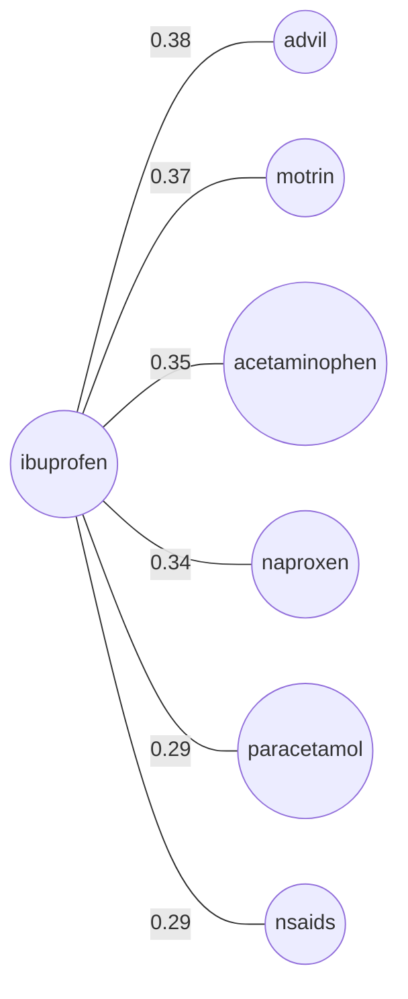
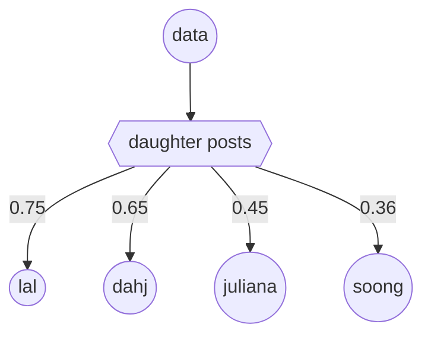

# solr-semantic-knowledge-graph

Proof-of-concept demonstrating <a href="https://solr.apache.org" target="_blank">Solr</a>'s **Semantic Knowledge Graph** — a technique that treats Solr's inverted index as a graph. By measuring how terms co-occur across documents, it discovers semantic relationships purely from the statistical distribution of words in your own corpus, effectively turning your search index into both a knowledge graph and a language model. No LLMs, no hand-coded synonyms, no external knowledge bases.

## Table of Contents

- [What this is](#what-this-is)
- [Prerequisites](#prerequisites)
- [Setup](#setup)
- [Running](#running)
- [What each example shows](#what-each-example-shows)
- [Architecture](#architecture)

---

This repo shows five things you can do with that capability:

1. **Find related terms** — query any term, get back a ranked list of semantically similar terms
2. **Cross-domain** — the same technique works on medical Q&A, sci-fi lore, cooking, travel, or anything else
3. **Query expansion** — turn the SKG output into a boosted query string with five different precision/recall tradeoff strategies
4. **Content-based recommendations** — classify document terms against a category to build a recommendation query
5. **Arbitrary relationships** — compose traversal hops to ask graph-style questions ("what is Data's *daughter*?")

---

## What this is

Solr builds an **inverted index** — a lookup table mapping every term to the documents it appears in, and how often. Solr's `relatedness()` facet function exploits this index by comparing two distributions:

- **Foreground** — documents matching your query (e.g., posts mentioning "ibuprofen")
- **Background** — all documents in the collection

A term gets a **high relatedness score** when it appears *much more often* in the foreground than in the background. Advil and motrin spike in ibuprofen posts; "the" and "a" do not — they're equally common everywhere. The result is an automatically discovered synonym and concept graph, grounded entirely in your corpus.

**Under the hood:** the JSON facet request `skg.ts` sends to Solr looks like this:

```json
{
  "query": "content:ibuprofen",
  "facet": {
    "related_terms": {
      "type": "terms",
      "field": "content",
      "limit": 10,
      "facet": {
        "relatedness": "relatedness(query('content:ibuprofen'), query('*:*'))"
      }
    }
  }
}
```

The inner `relatedness()` call is the key: the first argument is the foreground query, the second (`*:*`) is the background. Solr scores each candidate term by how much its document frequency shifts between the two sets.

The output is a weighted term graph — query any word and get back a ranked neighborhood of semantically related concepts:



No medical ontology. No hand-coded synonyms. Just corpus statistics.

---

## Prerequisites

- **Docker Desktop** — to run Solr
- **Node.js 18+** — for native `fetch` and modern `fs` APIs
- **CSV files in `data/`**

### Data layout

```
data/
├── jobs/jobs.csv
├── health/posts.csv
├── cooking/posts.csv
├── scifi/posts.csv
├── travel/posts.csv
└── devops/posts.csv
```

---

## Setup

```bash
git clone <this-repo>
cd solr-semantic-knowledge-graph

# Decompress the data files
gunzip data/cooking/posts.csv.gz \
       data/devops/posts.csv.gz \
       data/health/posts.csv.gz \
       data/jobs/jobs.csv.gz \
       data/scifi/posts.csv.gz \
       data/travel/posts.csv.gz

# Start Solr (single node, no ZooKeeper)
docker compose up -d

# Install dependencies
npm install

```

---

## Running

### Index data

```bash
npm run index
```

Creates and populates seven Solr collections: `jobs`, `health`, `cooking`, `scifi`, `travel`, `devops`, and `stackexchange` (the five StackExchange sets merged). Each collection is wiped and rebuilt from scratch on every run. Depending on CSV sizes, expect a few minutes total. Progress is logged per collection:

```
jobs: 30002 documents indexed
health: 12892 documents indexed
...
stackexchange: 389109 documents indexed
```

### Run the demo

```bash
npm run demo
```

Runs five labeled examples against the indexed collections and prints results with plain-English commentary explaining each number and decision.

---

## What each example shows

**Example 1 — Related Terms (health):** Queries "ibuprofen" against the health collection. It instantly surfaces *advil*, *motrin*, *acetaminophen*, and *naproxen* — discovering OTC pain-relief synonyms and generic/brand pairings purely via word distribution.

**Example 2 — Domain Switch (stackexchange):** Runs the exact same code against a multi-domain collection using the query "kryptonite". Without any external dictionary, the SKG immediately shifts domains to surface *superman*, *kryptonians*, and *smallville*.

**Example 3 — Query Expansion (stackexchange):** Explores 5 distinct strategies to turn SKG terms into boosted Solr queries. Demonstrates how to balance precision and recall — an OR strategy expands matches by +755%, while a stricter "required + optional boost" strategy targets the highest-quality 268 posts.

**Example 4 — Content-Based Recommendations (stackexchange):** Classifies a mixed bag of pop-culture terms against a "star wars" foreground. Sci-fi terms score high, while DC comics terms (*gotham*, *batman*) score *negative*, filtering out the noise. Converts the positive terms into a boosted recommendation string to fetch highly relevant documents.

**Example 5 — Arbitrary Relationships (scifi):** Two-hop traversal: `"data" → "daughter" → related terms`. Data is the android character from Star Trek: The Next Generation. By isolating posts where Data and daughter intersect, the index surfaces *Lal* (his daughter in TNG) and *Dahj* (his daughter in Picard) — bridging two TV shows filmed 30 years apart, with no knowledge graph or ontology.



---

## Architecture

| File | Role |
|------|------|
| [src/solr-client.ts](src/solr-client.ts) | Thin HTTP wrapper (`solrGet`, `solrPost`, `solrPostForm`) |
| [src/indexer.ts](src/indexer.ts) | Collection lifecycle + CSV ingestion |
| [src/skg.ts](src/skg.ts) | `buildRequest`, `traverse`, `buildExpandedQuery` |
| [src/index.ts](src/index.ts) | `npm run index` entry point |
| [src/demo.ts](src/demo.ts) | `npm run demo` entry point |
